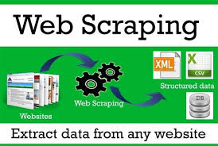

# WebScraping and Data Wrangling
Data wrangling is the process of gathering, selecting, and transforming data to solve the analytical problem in data science. On the other hand, web scraping is the method to obtain large datasets from the website that can be done using beautiful soup. These methods are essential when we need to create datasets via a website. So, Here, I have used these methods to make the datasets and implement the methodology.

Steps in data wrangling:
1)	Data discovery.
2)	Data structuring.
3)	Data cleaning.
4)	Data enriching.
5)	Data validating.
6)	Data publishing.
# Data scraping Methodology:
.Beautiful Soup

# Built With:
1) Anaconda Environment
2) Jupyter Notebook
3) Python libraries
